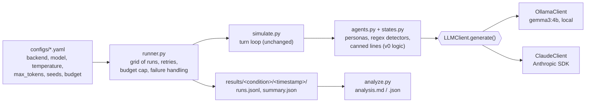

# Crisis Negotiation Simulator: Claude rebuild

**Swapping Gemma 3 for Claude Sonnet 4.6 kept the authority effect (95% release) but erased the empathy effect (95% → 5%), because the empathy detector's regex patterns, tuned to Gemma's phrasing, never fired on Claude's ("I hear you"): calmness never rose above 0.30 in any Sonnet empathy-vs-unstable run.**

An FBI negotiator agent and a hostage-taker agent negotiate over a pregnant hostage and a getaway vehicle: 2 FBI personas (empathy, authority) × 2 criminal personas (unstable, calculated) × 2 starting roles. This repo rebuilds a university project on a shared LLM interface, reruns the original Gemma baseline (E1), and swaps in Claude with no other change (E2). Status: Milestones 0–2 of [`docs/SPEC.md`](docs/SPEC.md); see [`PROGRESS.md`](PROGRESS.md).

## Results: E1 (Gemma 3 4B) vs E2 (Claude Sonnet 4.6)

Same code, same prompts, same regex rule engine, 10 messages per negotiation, temperature 0.6, 20 runs per pairing (10 per starting role), 80 runs per condition. All numbers are from [`python -m src analyze`](src/analyze.py), run on [E1 analysis](results/e1/20261004-005801/analysis.md) and [E2 Sonnet analysis](results/e2_sonnet/20261005-014815/analysis.md); configs: [E1](results/e1/20261004-005801/config.yaml), [E2](results/e2_sonnet/20261005-014815/config.yaml).

**Release rate** (criminal releases the pregnant hostage; Wilson 95% CI):

| FBI persona → criminal persona | E1 Gemma 3 4B | E2 Claude Sonnet 4.6 |
| --- | --- | --- |
| Empathy → unstable | **19/20 = 95%** [76.4, 99.1] | **1/20 = 5%** [0.9, 23.6] |
| Authority → calculated | **19/20 = 95%** [76.4, 99.1] | **19/20 = 95%** [76.4, 99.1] |
| Empathy → calculated | 1/20 = 5% [0.9, 23.6] | 8/20 = 40% [21.9, 61.3] |
| Authority → unstable | 2/20 = 10% [2.8, 30.1] | 0/20 = 0% [0.0, 16.1] |
| All 80 runs | 41/80 = 51.2% [40.5, 61.9] | 28/80 = 35.0% [25.5, 45.9] |

FBI vehicle concessions: 0 of 80 runs in both conditions.

**Other metrics** (all 80 runs per condition):

| Metric | E1 Gemma 3 4B | E2 Claude Sonnet 4.6 |
| --- | --- | --- |
| Turn of first release, median (range) | 6 (3–9) | 7 (6–9) |
| Median GPT-2 perplexity | 24.813 | 28.254 |
| Median latency per call / per run ¹ | 40.2 s / 391.2 s | 5.3 s / 51.3 s |
| Repetitive LLM turns (original `_is_repetitive`) | 0/704 | 0/741 |
| Self-contradicting release turns ² | 86 of 104 | 59 of 59 |
| Calls cut off by the token limit | 0/704 | 0/741 |
| Cost per run (mean, estimated from tokens) | n/a (local) | $0.0382 ($3.06 for 80 runs) |

¹ Not like-for-like: E1 runs `gemma3:4b` on a local Windows machine (8 logical CPU cores, as logged), E2 calls the Anthropic API.
² Criminal turns where the rule engine prepended "I will release the pregnant hostage" and the model's own text in the same turn still mentions the van or vehicle.

**What got worse with Sonnet:** overall release rate (51.2% → 35.0%), median turn of first release (6 → 7), median perplexity (24.8 → 28.3; see limitations), and self-contradicting release turns (every one of 59). **What changed that the headline doesn't cover:** empathy → calculated rose from 5% to 40%.

### Why: the detectors, not the negotiation

The criminal's state only moves when a regex detector fires on the FBI's message. Re-running the criminal's own detectors on every FBI message it received:

| Pairing | Detector hits | E1 Gemma | E2 Sonnet |
| --- | --- | --- | --- |
| Empathy → unstable | empathy | 36 of 90 messages | **0 of 89** |
| | de-escalation | 4 of 90 | 0 of 89 |
| | messages containing "I hear you" | 6 of 90 | **75 of 89** |
| | highest calmness reached (release line above 0.7) | 0.99; 19/20 runs above 0.7 | **0.30** (the starting value); 0/20 |
| Empathy → calculated | vehicle delay (lowers cooperation) | 69 of 90 | 14 of 88 |
| | highest cooperation reached | 0.68; 0/20 runs above 0.7 | 0.87; 9/20 runs above 0.7 |
| Authority → calculated | logical threats | 59 of 88 | 59 of 87 |
| | highest cooperation reached | 0.87; 19/20 above 0.7 | 0.87; 19/20 above 0.7 |

The empathy regex accepts "I hear **your** frustration" or "I understand you **are** scared", not "I hear you" or "I understand you're scared". The code comment says the patterns are "based on actual FBI responses", i.e. the original Gemma transcripts. Both 2×2 changes trace to detector coverage: Sonnet's empathetic FBI never triggers the empathy detector, and rarely uses the delay phrasing that held Gemma's empathy-vs-calculated runs back. The one Sonnet empathy-vs-unstable release came from Claude's own words matching the release regex, not from the canned line (no canned release turn occurred in that pairing).

Examples (the first run in run order for each case): [release, authority → calculated](examples/sonnet_release_authority_vs_calculated.md) · [no release, empathy → unstable](examples/sonnet_no_release_empathy_vs_unstable.md).

## What the original code actually did

The original code is tagged [`v0-university`](https://github.com/AlejoPH03/crisis-negotiation-simulator/tree/v0-university). Where it disagrees with the project report, the code is treated as the truth, and E1 replaces the report's numbers. Full list: [`docs/DECISIONS.md`](docs/DECISIONS.md) D10.

- **One message of memory.** Each LLM call sees only the system prompt and the opponent's last message. The FSM handlers that pass 5 messages of history are never reached.
- **Outcomes are decided by regex rules, not by the model.** Detectors move the criminal's calmness (unstable) or cooperation (calculated). Above 0.7, a canned line ("I will release the pregnant hostage.") is prepended to the model's reply, and the FBI's regex then detects the release.
- **Persona gating is hard-coded.** The empathy detector only runs for the unstable criminal, and the logical-threat detector only for the calculated one. `_detect_authority` exists but is never called.
- **Detector quirks:**
  - The threat and escalation detectors share patterns, so one threat is penalised twice.
  - The logical-threat detector fires on almost any mention of "time" or "the situation".
  - The empathy detector misses the contraction "you're" that the FBI prompt itself asks for.
- **An agreement doesn't end the run.** The FBI's canned thank-you can repeat until the turn limit, which inflates the "rounds" metric. Agents also check their own replies for agreement, which can end a run early with no concession.
- **FBI concessions from the report can't be reproduced.** The FBI's canned vehicle line is unreachable, so the FBI concedes only if the model's own wording matches the criminal's regex. That happened in 0 of 80 E1 runs.
- **The report's embedding-based paraphrase detector does not exist in the code.** Agreement detection is regex only.
- **Repetition control was effectively off.** The repetition filter only runs in an unreachable code path.
- **The report's n doesn't match the code.** The report's figures came from n = 3 and 10 rounds, while the code had `n_trials = 1` and `max_rounds = 8`. E1 uses 10 runs per configuration (80 in total) and a 10-message limit.

## Model selection: why E2 runs on Sonnet, not Haiku

The spec plans E2 on Claude Haiku. Before scaling up, an E0 smoke test ran each criminal persona 5 times against each FBI persona on both models, through the E2 pipeline ([E0 summary](results/e0/20261003-172725/summary.md), [analysis](results/e0/20261003-172725/analysis.md); 40 runs, $1.16).

| E0 (20 runs per model) | Claude Haiku 4.5 | Claude Sonnet 4.6 |
| --- | --- | --- |
| Runs flagged `refusal` / `out_of_character` | 20/20 / 20/20 | 1/20 / 0/20 |
| Calls cut off at `max_tokens` (300) | 123/192 (64.1%) | 0/188 |
| Verdict (human review of the transcripts) | **Fail** | **Pass** |

The flags are a heuristic. The verdict came from reading the transcripts. The full Haiku E2 run (80 runs, $1.59) confirmed the problem: 482 of 789 calls (61.1%) hit the token limit, and only 4/80 runs ended in a release. It is kept as a documented negative result: [Haiku E2 analysis](results/e2/20261004-235415/analysis.md), [`configs/e2_haiku.yaml`](configs/e2_haiku.yaml).

## Architecture



## Design decisions

Full record: [`docs/DECISIONS.md`](docs/DECISIONS.md).

- **One interface, backends chosen by config.** `LLMClient.generate(system, messages, temperature, max_tokens)` has two implementations. The model, temperature, token limit, seed, run count and budget come from one YAML file per condition, hashed into every result record.
- **Equivalence-tested against the original.** A byte-for-byte copy of `v0-university` and the refactored code run on the same scripted replies and seeds: all 8 configurations, 30 scripts, 2 seeds, 566 cases. Transcripts, outcomes and every LLM request must be identical. Changing one threshold or one canned line makes the test fail. 719 tests, no network.
- **Errors are never dialogue.** The original turned API errors into the reply "Error getting response.". Now rate-limit, server and connection errors are retried with exponential backoff, and a run that still fails is logged as `failed`. Programming errors crash immediately.
- **Budget cap.** Cost is estimated from logged tokens and config prices and checked before every call. E2 Sonnet used $3.06 of its $6 cap.
- **Temperature via `extra_body`.** `anthropic` SDK 1.x removed the `temperature` keyword, but the API still accepts it for Sonnet 4.6, so it is sent in the request body to keep temperature 0.6 in every condition.
- **`max_tokens` 300 for Claude.** The personas ask for 120 words or fewer, and Ollama ignores the original `max_tokens: 150` (its option is `num_predict`). Sonnet never hit 300; Haiku hit it on 61% of calls.

## Limitations

- **Outcomes are regex measurements.** E1 and E2 measure how often each model's wording triggers hand-written detectors, not how well it negotiates. The headline result is about the detectors.
- **Canned lines contradict the model.** In the release turns of the [release example](examples/sonnet_release_authority_vs_calculated.md), the rule engine prepends "I will release the pregnant hostage." while Claude keeps demanding the vehicle. Those runs still count as releases.
- **Perplexity is a proxy.** It uses GPT-2 on the first 512 tokens of the transcript. Higher perplexity on Sonnet means less predictable to GPT-2, not worse dialogue. An LLM judge comes in Milestone 5.
- **Latency is not comparable.** The E1 numbers reflect local hardware (CPU only is logged) and E2 the API, so only the within-condition numbers are meaningful.
- **The "rounds" metric is unreliable.** Agreements don't end the run (see above), so the table reports the turn of first release instead.
- **Small n.** With 20 runs per pairing, the Wilson intervals are wide. LLM sampling isn't seeded, only the canned-line choices are.

## Next steps (spec Milestones 3–6)

1. **E3: tools and classifier.** Agents act through tools (`release_pregnant_hostage`, `provide_vehicle`, …) that the rule engine validates, and one LLM tactic classifier replaces the 7 regex detectors. This addresses the detector-coverage problem above. Agents also get full per-agent history.
2. **E4: rule-free outcomes.** No thresholds or canned lines: does the 2×2 pattern appear when the model decides?
3. **E5: tier comparison.** To be redefined now that E2 runs on Sonnet (open question in DECISIONS D24).
4. **Evaluation.** An LLM judge validated against 20 hand-scored transcripts, rule-violation counts, and detector agreement (Cohen's kappa between regex and classifier).
5. **Write-up.** README and CV with the final numbers.

## How I'd adapt this for a customer

- **Simulated difficult customers.** The persona agents become difficult customers (angry, anxious, calculating) that stress-test a customer-service bot before launch: same harness, a config per persona, logged and budget-capped runs.
- **Don't trust a rule-based eval across models.** The lesson from this project: an eval built from regexes tuned on one model's outputs silently stopped measuring when the model changed. Here, an empathetic reply scored as zero empathy. Check detector coverage on the new model's outputs (the detector-hit table above takes one command) before reading anything into a metric change, and prefer an LLM classifier with a validated agreement rate.

## Quick start

```bash
python -m venv .venv && .venv\Scripts\activate        # Windows; use source .venv/bin/activate elsewhere
pip install -r requirements.txt
cp .env.example .env                                    # add ANTHROPIC_API_KEY (Claude runs only)
ollama pull gemma3:4b                                   # Gemma runs only

pytest                                                                  # tests, no network
python -m src negotiate  --config configs/e2_sonnet.yaml                # one Claude negotiation
python -m src negotiate  --config configs/e1_gemma.yaml                 # one Gemma negotiation
python -m src experiment --config configs/e1_gemma.yaml                 # E1: 80 runs
python -m src experiment --config configs/e2_sonnet.yaml                # E2: 80 runs, asks before spending
python -m src smoke      --config configs/e0_smoke.yaml                 # E0 smoke test
python -m src analyze    results/e2_sonnet/<timestamp> --phrase "I hear you"
```

Add `--dry-run` to `negotiate`, `experiment` or `smoke` to use canned mock replies (no Ollama, no API, no cost).

## Origin

This began as a University of Nottingham COMP3004 group project (Gemma 3 via Ollama) and was rebuilt independently in 2026. As the original report concluded, AI here is a research and training tool, not a replacement for human negotiators.
